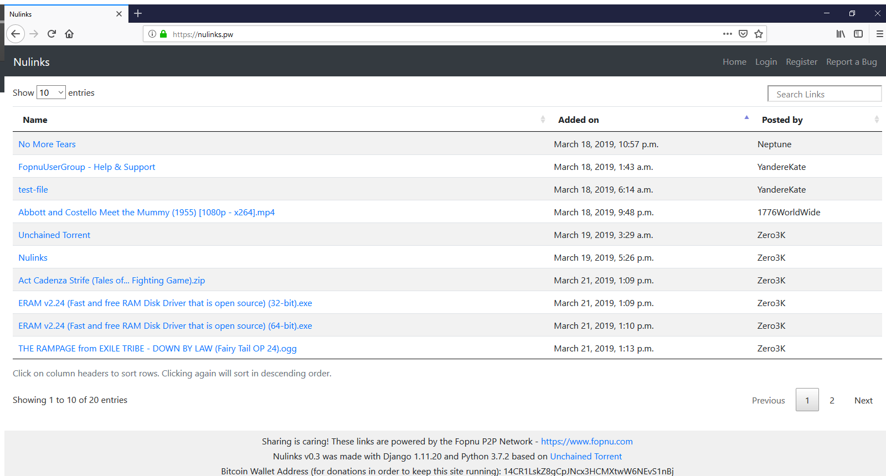
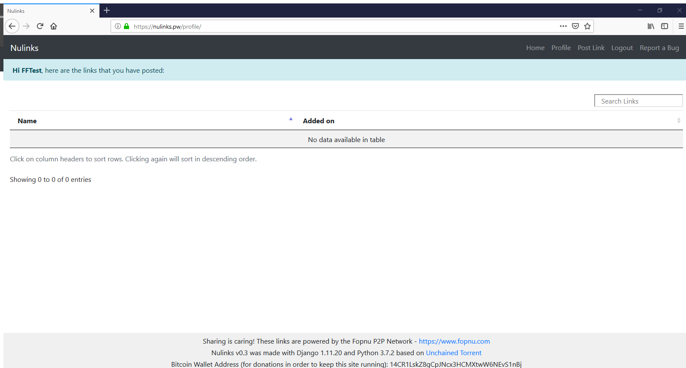
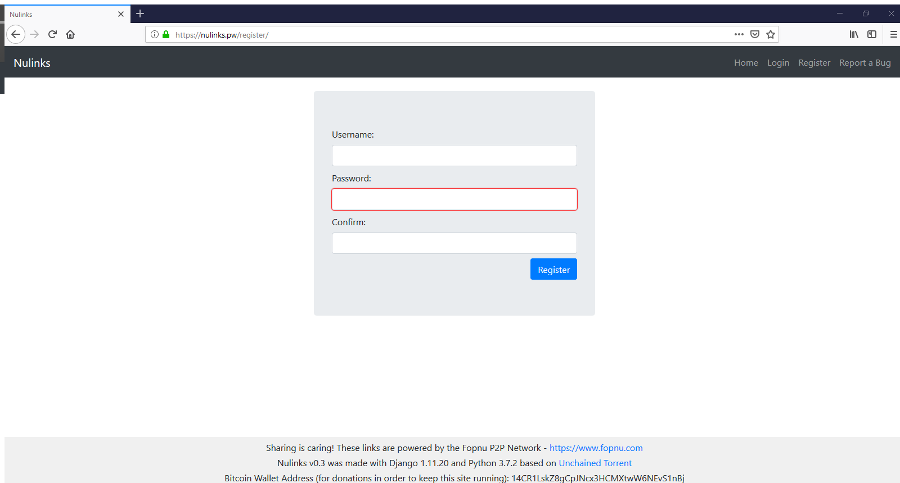
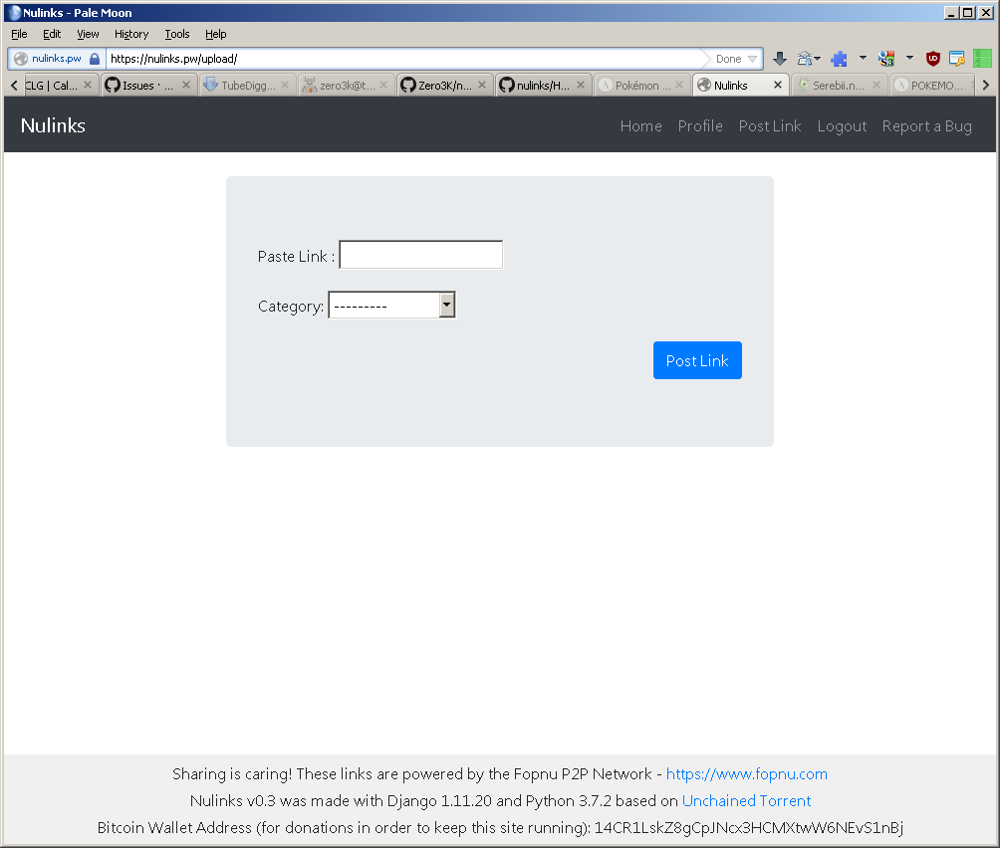

# Nulinks
### The website (available at https://nulinks.pw) is built using Python, Django, HTML, CSS, Bootstrap and JavaScript.
#### Features of the website:
- Creation of a user account.
- Posting Fopnu links by registered users.
- Seaching and downloading files.

## Home

## Login

## Profile

## Signup

## Post Link

